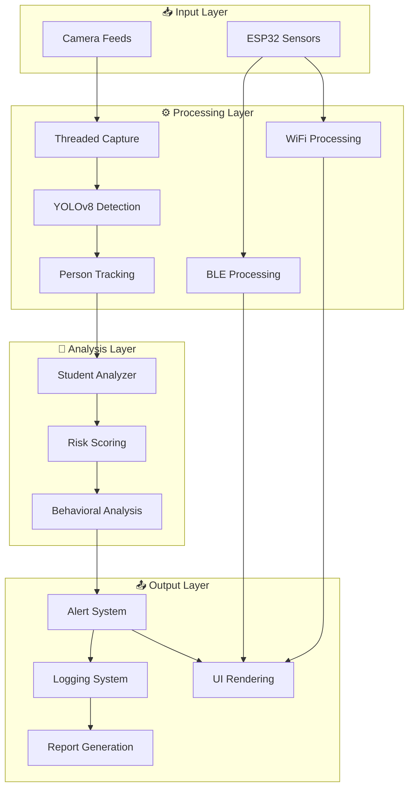
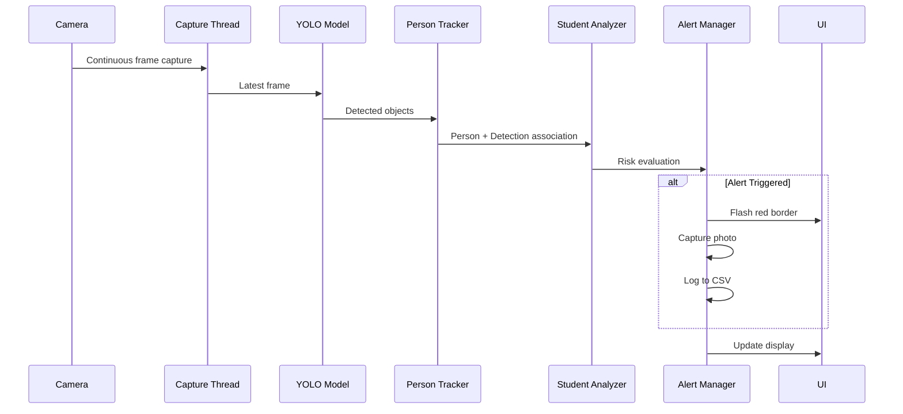
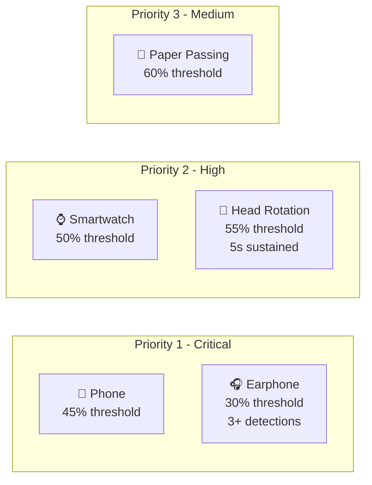
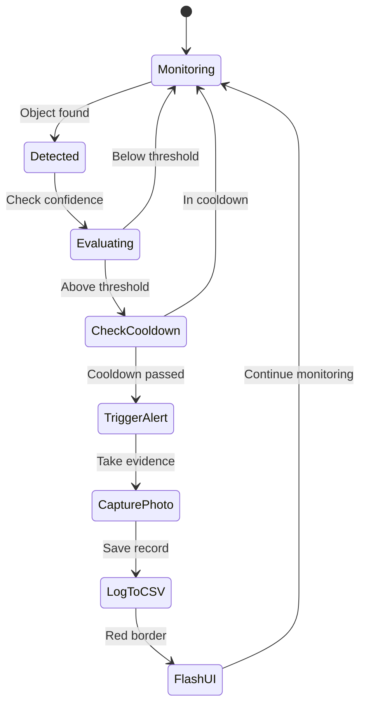

# 🎓 ExamShield - Comprehensive Technical Documentation

**AI-Powered Exam Proctoring System with IoT Integration**

**Copyright © 2025 Sejong University**

---

## Table of Contents

1. [System Overview](#system-overview)
2. [Architecture](#architecture)
3. [Core Components](#core-components)
4. [Detection Engine](#detection-engine)
5. [Alert Management](#alert-management)
6. [ESP32 Integration](#esp32-integration)
7. [Configuration Reference](#configuration-reference)
8. [API Documentation](#api-documentation)
9. [Deployment Guide](#deployment-guide)
10. [Performance Optimization](#performance-optimization)

---

## System Overview

ExamShield is an advanced exam proctoring solution combining:
- **Computer Vision** - YOLOv8 object detection
- **Deep Learning** - PyTorch neural networks
- **IoT Sensors** - ESP32 BLE/WiFi monitoring
- **Real-time Processing** - Threaded camera capture
- **Intelligent Alerting** - Smart cooldown system

### Supported Modes

| Mode | Cameras | Use Case | File |
|------|---------|----------|------|
| **Standard** | 1 | Individual exams, testing | `src/main.py` |
| **Pro** | 4 | Small exam halls | `src/Main_Pro.py` |
| **Enterprise** | 16 | Large-scale deployments | `src/main_Enterprise.py` |
| **Video Analysis** | File input | Post-exam review | `src/videotodetect.py` |

---

## Architecture

### High-Level System Diagram



### Data Flow



---

## Core Components

### 1. Config Class

Central configuration management for all system parameters.

**Location**: All `src/*.py` files (lines 43-128)

```python
class Config:
    # Model Configuration
    DETECTION_MODEL = "runs/detect/examshield_yolov8s/weights/best.pt"
    IMG_SIZE = 416
    CONFIDENCE_THRESHOLD = 0.30
    
    # Alert Thresholds
    ALERT_THRESHOLD = {
        "phone": 0.45,
        "earphone": 0.30,
        "smartwatch": 0.50,
        "headrotation": 0.55,
        "paperpassing": 0.60
    }
    
    # Camera Settings
    FRAME_WIDTH = 1280
    FRAME_HEIGHT = 720
    TARGET_FPS = 30
    
    # Alert Management
    ALERT_COOLDOWN = 10  # seconds
    MAX_PHOTOS_PER_ALERT = 3
    PHOTO_INTERVAL = 2  # seconds
```

**Key Parameters**:
- `DETECTION_MODEL` - Path to YOLOv8 weights
- `ALERT_THRESHOLD` - Detection confidence thresholds per class
- `ALERT_COOLDOWN` - Minimum time between alerts (prevents spam)
- `MAX_PHOTOS_PER_ALERT` - Evidence capture limit

### 2. CameraHandler

Threaded camera capture for optimal performance.

**Purpose**: Eliminates frame lag by continuous background capture

```python
class CameraHandler:
    def __init__(self):
        self.running = True
        self.frame_queue = queue.Queue(maxsize=2)
        self._initialize_camera()
        self._start_capture_thread()
    
    def read(self) -> np.ndarray:
        # Non-blocking read of latest frame
        return self.frame_queue.get(timeout=0.2)
```

**Benefits**:
- No waiting for `cap.read()`
- Consistent FPS regardless of processing time
- Automatic buffer management

### 3. PersonTracker

Multi-student tracking using centroid matching algorithm.

**Algorithm**:
1. Calculate bounding box centroids
2. Match to existing persons (nearest neighbor)
3. Assign unique IDs (persistent across frames)
4. Handle timeout for left students

```python
class PersonTracker:
    def update(self, person_boxes):
        # Centroid-based tracking
        for cx, cy, box in new_centroids:
            nearest_id = find_nearest_existing(cx, cy)
            if distance < TRACKING_MAX_DISTANCE:
                update_person(nearest_id, box)
            else:
                create_new_person(box)
```

**Configuration**:
- `TRACKING_MAX_DISTANCE = 150` pixels
- `TRACKING_TIMEOUT = 3.0` seconds

### 4. AlertManager

Intelligent alert system with cooldown management.

**Features**:
- Per-class cooldown periods
- Photo capture limits
- Active alert tracking
- Flash animation control

```python
class AlertManager:
    def can_alert(self, class_name) -> bool:
        # Check if cooldown period has passed
        time_elapsed = current_time - self.last_alert_time[class_name]
        return time_elapsed >= Config.ALERT_COOLDOWN
    
    def can_take_photo(self, class_name) -> bool:
        # Check photo limits and spacing
        return (photo_count < MAX_PHOTOS and 
                time_since_photo >= PHOTO_INTERVAL)
```

### 5. StudentAnalyzer

Behavioral analysis and risk scoring for individual students.

**Tracks**:
- Detection history (last 30)
- Earphone detections (requires 3+)
- Head rotation duration
- Average confidence
- Risk score

```python
class StudentAnalyzer:
    def add_detection(self, class_name, confidence):
        self.detections.append({
            'class': class_name,
            'confidence': confidence,
            'timestamp': time.time()
        })
        
    def get_risk_score(self) -> float:
        # Priority-weighted risk calculation
        weighted_sum = 0
        for detection in recent_detections:
            priority = CHEATING_CLASSES[class]['priority']
            weight = 4 - priority  # Higher priority = more weight
            weighted_sum += confidence * weight
        
        return (weighted_sum / total_weight) * 100
```

**Risk Levels**:
- `< 25%` - SAFE
- `25-50%` - LOW
- `50-75%` - MEDIUM
- `> 75%` - HIGH

---

## Detection Engine

### YOLOv8 Model

**Specifications**:
- Architecture: YOLOv8s (small)
- Input size: 416x416
- Classes: 5 (phone, earphone, smartwatch, headrotation, paperpassing)
- Model size: 22.6 MB
- Inference time: ~30-50ms (GPU) / ~200-300ms (CPU)

### Detection Classes



### Confidence Calibration

Adjusts raw detection confidence for better accuracy:

```python
CONFIDENCE_CALIBRATION = {
    "phone": 1.0,        # No adjustment
    "earphone": 1.0,     # No adjustment
    "smartwatch": 1.0,   # No adjustment
    "headrotation": 1.2, # Boost by 20%
    "paperpassing": 1.3  # Boost by 30%
}

calibrated_conf = raw_conf * CALIBRATION[class_name]
```

---

## Alert Management

### Alert Lifecycle



### Photo Capture Strategy

**Rules**:
1. Maximum 3 photos per alert incident
2. Minimum 2 seconds between photos
3. Photos saved to `proofs/alerts/`
4. Filename format: `{class}_{alert_id}_{photo_num}.jpg`

**Example**:
```
proofs/alerts/
├── phone_20251208_143022_1.jpg
├── phone_20251208_143022_2.jpg
├── phone_20251208_143022_3.jpg
└── earphone_20251208_143105_1.jpg
```

---

## ESP32 Integration

### BLE Scanner

**Functionality**: Detects Bluetooth devices within 5 meters

**Data Format** (UDP JSON):
```json
{
  "event": "FREQUENT_DEVICES_SUMMARY",
  "totalScans": 10,
  "frequentDevicesCount": 3,
  "devices": [
    {
      "name": "iPhone 13",
      "address": "AA:BB:CC:DD:EE:FF",
      "rssi": -45,
      "distance": 2.3,
      "seenCount": 8,
      "rank": 1
    }
  ]
}
```

**Distance Calculation**:
```cpp
float distance = (0.89976) * pow(ratio, 7.7095) + 0.111;
```

### WiFi Sniffer

**Functionality**: Monitors WiFi packets on all channels (1-14)

**Data Format** (TCP Binary):
```c
struct packet_info_t {
    uint8_t mac[6];        // Source MAC
    int8_t rssi;          // Signal strength
    uint32_t timestamp;   // Packet timestamp
    uint16_t packet_len;  // Length
    uint8_t channel;      // Channel number
    uint8_t packet_type;  // 0=mgmt, 1=data, 2=ctrl
};
```

---

## Configuration Reference

### Environment Setup

**Python 3.8+ Required**

Install dependencies:
```bash
pip install -r requirements.txt
```

Dependencies:
- `ultralytics==8.3.229` - YOLOv8 framework
- `opencv-python==4.12.0.88` - Computer vision
- `torch==2.9.1` - Deep learning
- `numpy==2.2.6` - Numerical computing

### GPU Acceleration

**Automatic Device Selection**:
1. NVIDIA GPU (CUDA) - Fastest
2. Intel Arc GPU (DirectML) - Fast
3. CPU - Slowest but always works

Check detected device in logs:
```
🚀 Acceleration: CUDA (NVIDIA GPU)
🚀 Acceleration: DirectML (Intel Arc GPU)
🚀 Acceleration: CPU
```

---

## API Documentation

### Main Application Class

```python
class ExamShield:
    def __init__(self):
        """Initialize ExamShield system"""
        
    def run(self):
        """Main application loop"""
        
    def _load_model(self) -> str:
        """Load YOLOv8 model, returns device name"""
        
    def _process_frame(self, frame: np.ndarray):
        """Process single frame through detection pipeline"""
        
    def _should_alert(self, class_name: str, confidence: float, 
                     student: StudentAnalyzer) -> Tuple[bool, str]:
        """Determine if alert should trigger"""
        
    def _save_alert_photo(self, class_name: str, frame: np.ndarray, 
                         student: StudentAnalyzer, reason: str):
        """Save evidence photo and log entry"""
```

---

## Deployment Guide

### Production Deployment Steps

1. **Hardware Setup**
   - Recommended: NVIDIA GPU (RTX 2060 or better)
   - Minimum: 8GB RAM, quad-core CPU
   - Cameras: USB 2.0+ or built-in webcams

2. **Software Installation**
   ```bash
   git clone https://github.com/MORSHEDMDMONOARUL/ExamShield.git
   cd ExamShield
   python -m venv .venv
   .venv\Scripts\activate
   pip install -r requirements.txt
   ```

3. **Model Verification**
   ```bash
   python -c "from ultralytics import YOLO; YOLO('runs/detect/examshield_yolov8s/weights/best.pt')"
   ```

4. **Test Run**
   ```bash
   python src/main.py
   ```

### Multi-Camera Setup

**Pro Mode (4 cameras)**:
```bash
python src/Main_Pro.py
```

Connect cameras before starting. System will auto-detect.

**Enterprise Mode (16 cameras)**:
```bash
python src/main_Enterprise.py
```

Supported: Up to 16 USB cameras or network streams.

---

## Performance Optimization

### Bottleneck Analysis

| Component | Time (ms) | Optimization |
|-----------|-----------|--------------|
| Camera capture | 5-10 | ✅ Threaded |
| YOLO inference | 30-50 (GPU) | ✅ GPU accel |
| Post-processing | 5-10 | ✅ NumPy vectorization |
| UI rendering | 10-20 | ✅ Overlays only |

**Total latency**: ~50-90ms per frame (10-20 FPS possible)

### Tips for Better Performance

1. **Use GPU** - 5-10× faster inference
2. **Reduce resolution** - 640×480 for faster processing
3. **Lower IMG_SIZE** - 320 instead of 416
4. **Decrease TARGET_FPS** - 15 FPS still effective
5. **Limit cameras** - More cameras = more processing

---

## Troubleshooting

See [docs/TROUBLESHOOTING.md](TROUBLESHOOTING.md) for common issues.

---

**Documentation Version**: 2.2.2  
**Last Updated**: December 8, 2025  
**Copyright**: © 2025 Sejong University

For questions, open an issue on [GitHub](https://github.com/MORSHEDMDMONOARUL/ExamShield/issues).

