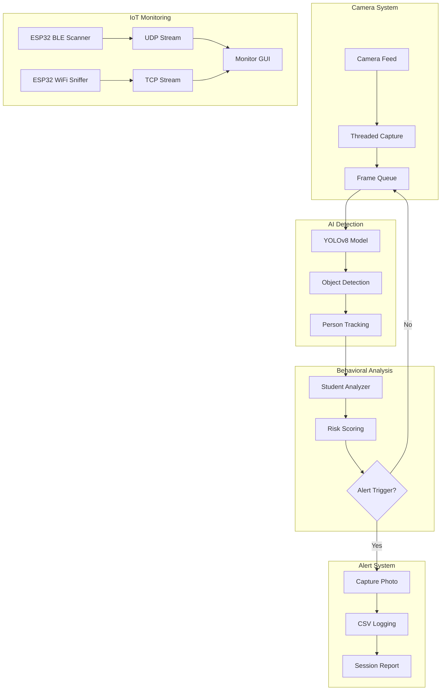

<div align="center">

# 🛡️ ExamShield

### AI-Powered Exam Proctoring System with IoT Integration

[](https://www.python.org/downloads/)
[](https://github.com/ultralytics/ultralytics)
[](https://opencv.org/)
[](https://www.espressif.com/)
[](LICENSE)
[](CONTRIBUTING.md)

**Real-time AI exam monitoring** | **Multi-camera support** | **BLE & WiFi device detection** | **Intelligent alerting**

[Features](#-features) • [Quick Start](#-quick-start) • [Documentation](#-documentation) • [Demo](#-demo) • [Contributing](#-contributing)

</div>

---

## 📋 Table of Contents

- [Overview](#-overview)
- [Features](#-features)
- [System Architecture](#-system-architecture)
- [Quick Start](#-quick-start)
- [Installation](#-installation)
- [Usage](#-usage)
- [ESP32 Integration](#-esp32-integration)
- [Configuration](#%EF%B8%8F-configuration)
- [Documentation](#-documentation)
- [Future Roadmap](#-future-roadmap)
- [Contributing](#-contributing)
- [License](#-license)
- [Contact](#-contact)

---

## 🎯 Overview

**ExamShield** is a comprehensive AI-powered exam proctoring solution that combines computer vision, deep learning, and IoT sensors to ensure exam integrity. Built with YOLOv8 for object detection and ESP32 microcontrollers for environmental monitoring, ExamShield provides real-time alerts for potential cheating behaviors.

### 🔑 Key Capabilities

- **AI Object Detection**: Detects phones, earphones, smartwatches in real-time
- **Behavioral Analysis**: Monitors head rotation and suspicious movements
- **Multi-Student Tracking**: Supports multiple students per camera
- **IoT Integration**: ESP32-based BLE and WiFi device monitoring
- **Multi-Camera Support**: Single camera, 4-camera (Pro), and 16-camera

 (Enterprise) modes
- **Intelligent Alerting**: Smart cooldown system prevents false positives
- **GPU Acceleration**: CUDA, DirectML, and CPU support
- **Risk Scoring**: Weighted detection confidence with priority levels

---

## ✨ Features

### 🤖 AI Detection Capabilities

| Detection Class | Priority | Description | Threshold |
|----------------|----------|-------------|-----------|
| 📱 **Phone** | Critical | Mobile phone usage | 45% |
| 🎧 **Earphone** | Critical | Earbuds/headphones (requires 3+ detections) | 30% |
| ⌚ **Smartwatch** | High | Wearable device detection | 50% |
| 🔄 **Head Rotation** | High | Suspicious head movement (sustained 5s) | 55% |
| 📄 **Paper Passing** | Medium | Paper exchange between students | 60% |

### 💡 Smart Features

- ✅ **Threaded Camera Capture** - Zero frame lag with background processing
- ✅ **Person Tracking** - Centroid-based multi-student tracking
- ✅ **Alert Management** - Cooldown periods, photo limits, and spacing control
- ✅ **Risk Scoring** - Priority-weighted confidence analysis
- ✅ **Session Reporting** - Comprehensive CSV logs and summary reports
- ✅ **ESP32 Integration** - BLE scanner and WiFi sniffer for device detection
- ✅ **Video Analysis** - Process pre-recorded exam footage

### 🎥 Multi-Camera Modes

1. **Standard Mode** (`main.py`) - Single camera, full features
2. **Pro Mode** (`Main_Pro.py`) - 4 independent cameras
3. **Enterprise Mode** (`main_Enterprise.py`) - Up to 16 cameras, optimized performance

---

## 🏗️ System Architecture



---

## 🚀 Quick Start

### Prerequisites

- **Python 3.8+** installed
- **Webcam** or USB camera
- **(Optional)** ESP32 microcontrollers for IoT monitoring
- **(Optional)** NVIDIA GPU for faster processing

### One-Command Installation

```bash
# Clone the repository
git clone https://github.com/MORSHEDMDMONOARUL/ExamShield.git
cd ExamShield

# Install dependencies
pip install -r requirements.txt

# Run ExamShield
python src/main.py
```

**That's it!** ExamShield will start monitoring with your default camera.

### Keyboard Controls

| Key | Action |
|-----|--------|
| `Q` | Quit application |
| `S` | Take screenshot |
| `H` | Hide/show UI overlay |

---

## 📦 Installation

### Step 1: Clone Repository

```bash
git clone https://github.com/MORSHEDMDMONOARUL/ExamShield.git
cd ExamShield
```

### Step 2: Create Virtual Environment (Recommended)

```bash
# Create virtual environment
python -m venv .venv

# Activate (Windows)
.venv\Scripts\activate

# Activate (Linux/Mac)
source .venv/bin/activate
```

### Step 3: Install Dependencies

```bash
pip install -r requirements.txt
```

### Dependencies Installed:

- `ultralytics==8.3.229` - YOLOv8 framework
- `opencv-python==4.12.0.88` - Computer vision
- `torch==2.9.1` - Deep learning framework
- `torchvision==0.24.1` - Vision utilities
- `numpy==2.2.6` - Numerical computing
- `psutil==7.1.3` - System monitoring
- `Pillow==12.0.0` - Image processing

---

## 💻 Usage

### Standard Mode (Single Camera)

```bash
python src/main.py
```

Best for: Individual exam monitoring, testing, development

### Pro Mode (4 Cameras)

```bash
python src/Main_Pro.py
```

Best for: Small exam halls, multiple angle coverage

### Enterprise Mode (16 Cameras)

```bash
python src/main_Enterprise.py
```

Best for: Large exam halls, university-scale deployments

### Video Analysis Mode

```bash
python src/videotodetect.py
```

Process pre-recorded exam videos for post-exam analysis.

### ESP32 Monitor GUI

```bash
python src/esp32_monitor_gui.py
```

Real-time visualization of BLE and WiFi device detection.

---

## 📡 ESP32 Integration

### BLE Scanner Setup

1. **Flash `BLE+WIFI/ble.ino` to ESP32**
   ```arduino
   // Update WiFi credentials (lines 14-15)
   const char* ssid = "Your-WiFi-SSID";
   const char* password = "Your-WiFi-Password";
   
   // Update laptop IP (line 19)
   const char* targetIP = "192.168.1.100";  // Your computer's IP
   ```

2. **Run BLE Monitor**
   ```bash
   python BLE+WIFI/ble.py
   ```

### WiFi Sniffer Setup

1. **Flash `BLE+WIFI/wifi.ino` to ESP32**
2. **Run WiFi Monitor**
   ```bash
   python BLE+WIFI/wifi.py
   ```

### Combined Monitoring

```bash
python src/esp32_monitor_gui.py
```

Displays both BLE and WiFi detections in a unified interface.

---

## ⚙️ Configuration

### Camera Settings

Edit configuration in `src/main.py` (lines 43-128):

```python
class Config:
    # Video settings
    FRAME_WIDTH = 1280
    FRAME_HEIGHT = 720
    TARGET_FPS = 30
    
    # Detection thresholds
    ALERT_THRESHOLD = {
        "phone": 0.45,
        "earphone": 0.30,
        "smartwatch": 0.50,
        "headrotation": 0.55,
        "paperpassing": 0.60
    }
    
    # Alert management
    ALERT_COOLDOWN = 10  # seconds
    MAX_PHOTOS_PER_ALERT = 3
    PHOTO_INTERVAL = 2   # seconds
```

### Model Configuration

ExamShield uses a custom-trained YOLOv8 model:
- **Path**: `runs/detect/examshield_yolov8s/weights/best.pt`
- **Size**: 22.6 MB
- **Classes**: 5 (phone, earphone, smartwatch, headrotation, paperpassing)

To use your own model:
```python
DETECTION_MODEL = "path/to/your/model.pt"
```

---

## 📚 Documentation

- **[Installation Guide](docs/INSTALLATION.md)** - Detailed setup instructions
- **[ESP32 Setup](docs/ESP32_SETUP.md)** - Complete ESP32 configuration
- **[API Reference](docs/API_REFERENCE.md)** - Class and function documentation
- **[Architecture](docs/ARCHITECTURE.md)** - System design and diagrams
- **[Troubleshooting](docs/TROUBLESHOOTING.md)** - Common issues and solutions
- **[Contributing Guide](CONTRIBUTING.md)** - How to contribute

---

## 🔮 Future Roadmap

### v2.3.0 (Short-term)
- [ ] Web-based dashboard for remote monitoring
- [ ] Database integration (PostgreSQL / MongoDB)
- [ ] Email / SMS alert notifications
- [ ] Mobile app for supervisors
- [ ] Advanced analytics and reporting

### v3.0.0 (Mid-term)
- [ ] Facial recognition for student identification
- [ ] Gaze tracking for attention monitoring
- [ ] Speech detection for verbal cheating
- [ ] Cloud deployment support (AWS / Azure)
- [ ] Multi-language support

### v4.0.0 (Long-term)
- [ ] AI behavior prediction models
- [ ] Blockchain-based tamper-proof logs
- [ ] AR/VR exam environment support
- [ ] Integration with Learning Management Systems (LMS)

See [FUTURE_ROADMAP.md](FUTURE_ROADMAP.md) for detailed plans.

---

## 🤝 Contributing

We welcome contributions from the community! Here's how you can help:

### Ways to Contribute

- 🐛 **Report Bugs** - Use [issue templates](.github/ISSUE_TEMPLATE/)
- 💡 **Suggest Features** - Share your ideas
- 📖 **Improve Docs** - Help make documentation better
- 💻 **Submit PRs** - Fix bugs or add features
- ⭐ **Star the Repo** - Show your support!

### Development Setup

1. Fork the repository
2. Create a feature branch (`git checkout -b feature/AmazingFeature`)
3. Commit changes (`git commit -m 'Add some AmazingFeature'`)
4. Push to branch (`git push origin feature/AmazingFeature`)
5. Open a Pull Request

See [CONTRIBUTING.md](CONTRIBUTING.md) for detailed guidelines.

---

## 📄 License

This project is licensed under the **MIT License** - see the [LICENSE](LICENSE) file for details.

```
MIT License

Copyright (c) 2025 Sejong University
Developed by: Morshed MD Monoarul

Permission is hereby granted, free of charge, to any person obtaining a copy
of this software... (see LICENSE file for full text)
```

---

## 📧 Contact

**Morshed MD Monoarul** - Sejong University
- GitHub: [@MORSHEDMDMONOARUL](https://github.com/MORSHEDMDMONOARUL)
- Email: monoarulmorshed@gmail.com
- Institution: [Sejong University](https://www.sejong.ac.kr/)

**Project Link**: [https://github.com/MORSHEDMDMONOARUL/ExamShield](https://github.com/MORSHEDMDMONOARUL/ExamShield)

**Copyright**: © 2025 Sejong University. All rights reserved.

---

## 👥 Contributors

### Development Team

**Morshed MD Monoarul** - *Lead Developer*
- Main application development (YOLOv8 integration, multi-camera system)
- Dataset preparation and model training in Roboflow
- YOLOv8 model training and optimization
- ESP32 monitor GUI development (BLE + WiFi)
- System architecture and design
- Documentation and project management

**MIRAJ MD MEJBAH HOSSAIN** - *ESP32 IoT Developer*
- BLE scanner implementation (ESP32)
- WiFi sniffer development (ESP32)
- IoT sensor integration

**MANISH** - *AI Training Contributor*
- Model training assistance in Roboflow
- Training dataset photos contribution
- Data annotation support

**IKSA** - *AI Training Contributor*
- Model training assistance in Roboflow
- Training dataset photos contribution
- Data annotation support

### Institution

**Sejong University**
- Project supervision and resources
- Copyright holder

---

## 🙏 Acknowledgments

### Frameworks & Tools
- [Ultralytics YOLOv8](https://github.com/ultralytics/ultralytics) - Object detection framework
- [OpenCV](https://opencv.org/) - Computer vision library
- [Espressif ESP32](https://www.espressif.com/) - IoT microcontroller
- [PyTorch](https://pytorch.org/) - Deep learning framework
- [Roboflow](https://roboflow.com/) - Dataset management and model training platform

### Training Pipeline
- Dataset preparation: Roboflow
- Model architecture: YOLOv8s
- Training: Custom dataset with 5 cheating detection classes
- Annotation: Team collaborative effort

### Special Thanks
- Sejong University for project support and resources
- All contributors for their dedication to academic integrity
- Open source community for the amazing tools

---

## 📊 Project Stats


---

<div align="center">

**Made with ❤️ for academic integrity**

*If you find ExamShield useful, please consider giving it a ⭐️*

[⬆ Back to Top](#️-examshield)

</div>

